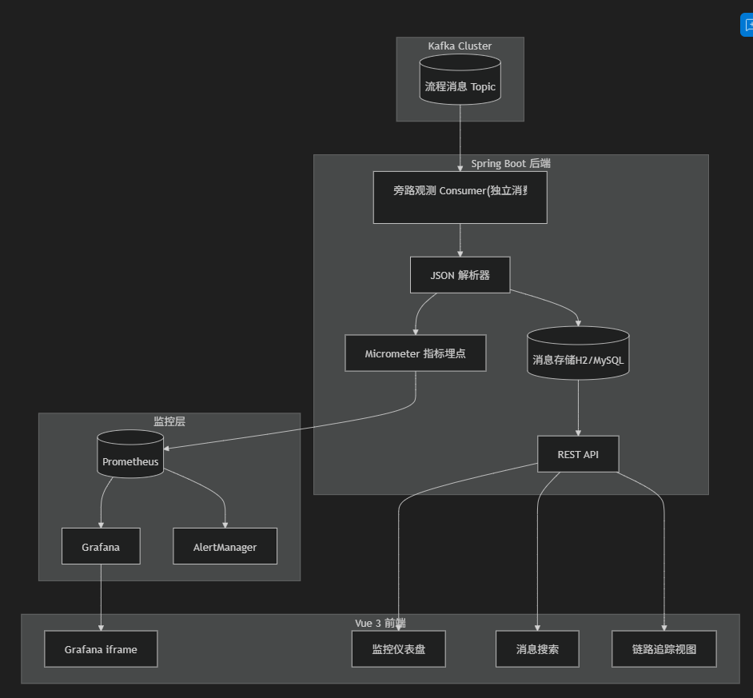

# Kafka 流程监控系统实施计划

基于您提供的 JSON 数据结构和需求，设计一个完整的 Spring Boot + Vue 前后端分离监控系统。

------

## JSON 数据分析

根据您提供的样例，关键字段提取如下：

| 字段路径                              | 用途            | 监控维度          |
| :------------------------------------ | :-------------- | :---------------- |
| `priTenant`                           | 租户标识 (BIOM) | 按租户分组统计    |
| `taskId`                              | 任务唯一 ID     | 链路追踪、去重    |
| `adviseKey`                           | 业务键          | 业务分类          |
| `transRequest.systemNo`               | 系统编号        | 按系统分组        |
| `transRequest.operDetail.nodeName`    | 当前节点名      | 节点状态/耗时分析 |
| `transRequest.businessProcess.busId`  | 业务 ID         | 业务流程追踪      |
| `transRequest.businessProcess.busVer` | 业务版本        | 版本分布          |

------

## 系统架构



------

## User Review Required

IMPORTANT

**技术选型确认**

1. **数据库选择**：计划使用 H2（开发）/ MySQL（生产）存储原始消息用于搜索，是否符合您的预期？
2. **Kafka 消费模式**：采用"旁路观测 Consumer"方案（独立消费组），不侵入主业务链路。如需获取业务处理结果，需主消费者回写结果 Topic。
3. **告警通知**：默认集成 AlertManager，支持邮件/Webhook。如需钉钉/企微，请确认。

WARNING

**延迟计算依赖**

- 端到端延迟需要消息中包含 `produceTime` 时间戳字段，当前样例未见此字段。
- 建议在生产端埋入 `timestamp` 字段，否则只能计算"进入系统后的处理延迟"。

------

## Proposed Changes

### Component 1: Spring Boot 后端

#### [NEW] pom.xml

Maven 项目配置，依赖：

- `spring-boot-starter-web`
- `spring-kafka`
- `micrometer-registry-prometheus`
- `spring-boot-starter-data-jpa` + H2
- `spring-boot-starter-actuator`

------

#### [NEW] application.yml

配置 Kafka、Prometheus、数据库连接

------

#### [NEW] KafkaMessage.java

消息实体类，映射 JSON 结构的关键字段

------

#### [NEW] MessageObserverConsumer.java

旁路观测消费者：

- 独立消费组 `monitor-observer-group`
- 解析 JSON，提取指标维度
- 记录 Prometheus 指标
- 存储消息到数据库

------

#### [NEW] MetricsService.java

指标服务：

```
// 生产频率

Counter msgProducedTotal = Counter.builder("msg_produced_total")

    .tags("tenant", "system", "eventType")

    .register(registry);


// 消费结果

Counter msgConsumedTotal = Counter.builder("msg_consumed_total")

    .tags("tenant", "system", "result", "nodeName")

    .register(registry);


// 端到端延迟

Timer msgLatency = Timer.builder("msg_e2e_latency_seconds")

    .tags("tenant", "system", "nodeName")

    .publishPercentiles(0.5, 0.95, 0.99)

    .register(registry);


// 超时计数

Counter msgTimeoutTotal = Counter.builder("msg_timeout_total")

    .tags("tenant", "system", "nodeName", "threshold")

    .register(registry);
```

------

#### [NEW] MessageController.java

REST API：

- `GET /api/messages` - 分页查询消息
- `GET /api/messages/{taskId}` - 根据 taskId 查询
- `GET /api/messages/search` - 全文搜索
- `GET /api/stats/overview` - 统计概览

------

### Component 2: Vue 3 前端

#### [NEW] package.json

Vue 3 + Vite + Element Plus + ECharts

------

#### [NEW] src/views/Dashboard.vue

监控仪表盘首页：

- 实时消息数统计卡片
- 成功/失败率饼图
- 按租户/系统的消息量趋势

------

#### [NEW] src/views/GrafanaEmbed.vue

Grafana iframe 嵌入组件

------

#### [NEW] src/views/MessageSearch.vue

消息搜索界面：

- taskId / busId / tenant 搜索
- 时间范围筛选
- JSON 详情展开

------

#### [NEW] src/views/TraceView.vue

链路追踪视图：按 taskId 展示消息流转路径

------

### Component 3: 基础设施配置

#### [NEW] docker-compose.yml

Docker 编排：

- Kafka + Zookeeper
- Prometheus
- Grafana (预配置数据源)
- AlertManager

------

#### [NEW] prometheus/prometheus.yml

Prometheus 配置：抓取 Spring Boot Actuator 端点

------

#### [NEW] prometheus/alert-rules.yml

告警规则：

```
- alert: HighFailureRate

  expr: rate(msg_consumed_total{result="FAIL"}[5m]) / rate(msg_consumed_total[5m]) > 0.1

  for: 2m

  labels:

    severity: warning

  annotations:

    summary: "消息失败率超过 10%"


- alert: HighLatencyP95

  expr: histogram_quantile(0.95, rate(msg_e2e_latency_seconds_bucket[5m])) > 5

  for: 3m

  labels:

    severity: critical

  annotations:

    summary: "P95 延迟超过 5 秒"
```

------

#### [NEW] grafana/dashboards/kafka-monitor.json

预置 Grafana Dashboard：

- 生产频率面板
- 消费状态分布
- 延迟分位数图
- 超时趋势
- 按租户/系统筛选变量

------

## Verification Plan

### Automated Tests

1. **单元测试** - 验证 JSON 解析正确性

```
cd e:\wym\kafka\demo03

mvn test -Dtest=MessageParserTest
```

1. **集成测试** - 验证 Kafka 消费与指标采集

```
mvn test -Dtest=KafkaIntegrationTest
```

### Manual Verification

1. **启动基础设施**

```
cd e:\wym\kafka\demo03

docker-compose up -d
```

1. **启动后端服务**

```
mvn spring-boot:run
```

1. **验证 Prometheus 指标**
   - 访问 http://localhost:8080/actuator/prometheus
   - 确认 `msg_produced_total`、`msg_consumed_total` 等指标存在
2. **验证 Grafana Dashboard**
   - 访问 [http://localhost:3000](http://localhost:3000/) (admin/admin)
   - 打开预置的 Kafka Monitor Dashboard
   - 确认图表正确显示
3. **验证前端**

```
cd e:\wym\kafka\demo03\frontend

npm run dev
```

- 访问 [http://localhost:5173](http://localhost:5173/)
- 测试消息搜索功能
- 测试 Grafana iframe 嵌入

1. 模拟告警触发
   - 发送大量失败消息到 Kafka
   - 确认 AlertManager 触发告警

------

## 项目目录结构预览

```
e:\wym\kafka\demo03\

├── pom.xml

├── docker-compose.yml

├── prometheus/

│   ├── prometheus.yml

│   └── alert-rules.yml

├── grafana/

│   └── dashboards/

│       └── kafka-monitor.json

├── src/main/

│   ├── java/com/monitor/

│   │   ├── MonitorApplication.java

│   │   ├── config/

│   │   ├── entity/

│   │   ├── kafka/

│   │   ├── service/

│   │   ├── controller/

│   │   └── repository/

│   └── resources/

│       └── application.yml

└── frontend/

    ├── package.json

    ├── vite.config.js

    └── src/

        ├── views/

        ├── components/

        ├── api/

        └── router/
```